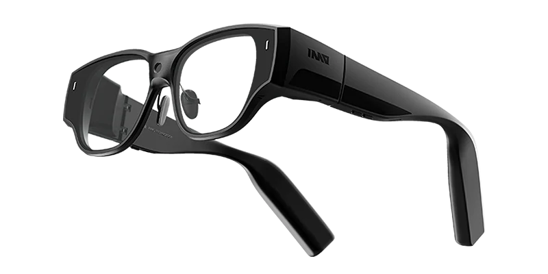

# Unofficial INMO Air 3 Community Wiki

Community-driven documentation for the INMO Air 3 smart glasses, compiled from the INMO Air 3 Discord community.

---

## Quick Start

New to INMO Air 3? Start here:

1. [Hardware Specifications](docs/hardware-specifications.md) - Display, camera, processor, and battery specs
2. [Setup & Configuration](docs/setup-and-configuration.md) - Initial setup and customization
3. [Essential Apps](docs/apps-and-software.md) - Recommended apps and software
4. [Tips & Tricks](docs/tips-and-tricks.md) - Get the most out of your glasses

---

## Documentation

### Core Guides

| Guide | Description |
|-------|-------------|
| [Hardware Specifications](docs/hardware-specifications.md) | Display, optics, camera, processor, battery, and temperature specs |
| [Apps & Software](docs/apps-and-software.md) | Essential apps, streaming, productivity tools, and limitations |
| [Setup & Configuration](docs/setup-and-configuration.md) | Initial setup, developer options, sideloading, and customization |
| [Battery & Power](docs/battery-and-power.md) | Battery life testing, charging practices, and power management |

### Usage & Optimization

| Guide | Description |
|-------|-------------|
| [Tips & Tricks](docs/tips-and-tricks.md) | Battery extension, display improvements, audio, heat reduction |
| [Screen Mirroring](docs/screen-mirroring.md) | iOS/Android mirroring, PC remote desktop, game streaming |
| [Comfort & Fit](docs/comfort-and-fit.md) | Nose pads, IPD optimization, vision correction, long-term wear |
| [Accessories](docs/accessories.md) | Controllers, power solutions, prescription lenses, lens protection |

### Troubleshooting & Support

| Guide | Description |
|-------|-------------|
| [Troubleshooting](docs/troubleshooting.md) | Screen burn-in, display issues, connectivity, overheating fixes |
| [Shipping & Support](docs/shipping-and-support.md) | Fulfillment info, returns, warranty, and support contacts |

### Community & Development

| Guide | Description |
|-------|-------------|
| [Community Mods](docs/community-mods.md) | 3D printing projects, software mods, physical modifications |
| [Future Development](docs/future-development.md) | Requested features and development resources |
| [Comparison](docs/comparison.md) | vs. XReal, RayNeo, Rokid, and Meta Ray-Ban |

---

## Critical Setup Tips

1. **Power OFF** when charging overnight (not standby)
2. **Use dark mode** to prevent burn-in
3. **Get large nose pads** for comfort beyond 30 minutes
4. **Use external battery** for extended sessions
5. **Avoid setting PIN code** on lock screen
6. **Close background apps** regularly to manage heat
7. **Disable unnecessary stock apps** to improve battery life

---

## Best For

- Remote work (laptop/desktop control)
- Private media consumption
- Productivity apps and multitasking
- Users needing vision correction
- Developers and tinkerers
- Privacy-conscious users (waveguide display)

## Not Ideal For

- All-day wearers (battery, weight, comfort)
- Casual users seeking simple smartglasses
- Outdoor use (bright sunlight washes out display)
- Users with IPD > 68mm or < 58mm
- Budget-conscious buyers

---

## Contributing

This wiki is compiled from community knowledge shared on the INMO Air 3 Discord. Feel free to submit pull requests with corrections or additions.

---

*Disclaimer: This is an unofficial community resource and is not affiliated with INMO.*
