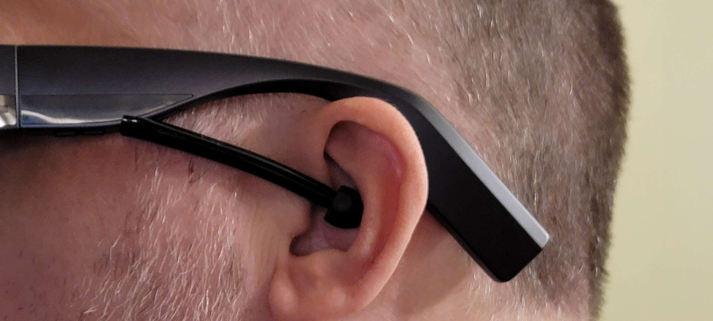

# Tips & Tricks

[← Back to Home](../README.md)

---

## Battery Life Extension

1. **Power Bank Setup**: Use 5000mAh battery bank for +3 hours use
2. **Charging Smartly**: Power off (not standby) when charging overnight
3. **Brightness Management**: Keep at 50-75% for extended use
4. **Background Apps**: Regularly close unused apps
5. **Disable Services**: Turn off stock apps you don't use
6. **Total Endurance**: With 5000mAh bank + internal = ~11 hours straight use

See [Battery & Power Management](battery-and-power.md) for detailed info.

---

## Improving Video & Display

1. **Remove Nose Pad**: Better vertical screen visibility (trade-off: discomfort after 1+ hour)
2. **Adjust Position**: Shift glasses left/right and up/down for optimal viewing
3. **Use Dark Mode**: Reduces burn-in risk and improves contrast
4. **Mini-Player Mode**: Keep videos in corner of vision while walking
5. **Chrome Remote Desktop**: Auto-borders display for clean edge visibility
6. **Full-Screen Apps**: Use landscape mode full-screen to maximize real estate

---

## Audio Improvements

| Solution | Description |
|----------|-------------|
| **DIY Sound Pipes** | Use aquarium tubing + earbud tips to improve bass and isolation (highly recommended by users) |
| **Bluetooth Headphones** | External speakers provide much better audio quality |
| **Stock Speakers** | Struggle in outdoor noise environments |

### DIY Sound Pipes

Attach aquarium tubing to the speaker outlets with silicone earbud tips on the ends. This directs sound into your ear canal, significantly improving bass response and noise isolation.

---

## Reducing Heat

1. Close background applications regularly
2. Disable unnecessary pre-installed apps
3. Apply foam heat shields to temples (removable)
4. Avoid using while charging for intensive tasks
5. Lower brightness reduces heat generation significantly
6. Use Cool or Balanced power mode instead of High Performance

See [Troubleshooting](troubleshooting.md) for overheating solutions.

---

## Comfort & Extended Use

1. **Large Nose Pads**: Available separately (~$6), extend comfortable wear from 30min to 2+ hours
2. **Positioning**: Wear lower on nose for better comfort
3. **Breaks**: Take 10-15 minute breaks per hour initially
4. **Anti-Shake Setting**: Adjust air mouse sensitivity under Input > Air Mouse Sensitivity

See [Comfort & Fit](comfort-and-fit.md) for detailed comfort optimization.

---

## Screen Burn-In Prevention

- **Don't** leave on standby while charging (glasses turn on when charging status changes)
- Use dark mode or third-party launchers
- Lower brightness below 50% for extended idle periods
- Full-screen video playback helps "exercise" pixels
- Temporary retention usually resolves within 24 hours

---

## Multitasking Strategies

| Strategy | Description |
|----------|-------------|
| **Taskbar App** | Create floating windows |
| **PiP Mode** | Watch videos while working |
| **Multiple Desktops** | Use Windows Virtual Desktops + Chrome Remote Desktop |
| **3DOF Multi-Screen** | Space Multiscreen app (3 vertical screens) |

---

## For Public Use

- Enable mini-player mode for YouTube/Netflix
- Tilt head back slightly to see over display while walking
- Screen positioned in upper FOV allows downward vision
- One user reports glasses pass as regular glasses if you change the logos

---

[← Back to Home](../README.md)
